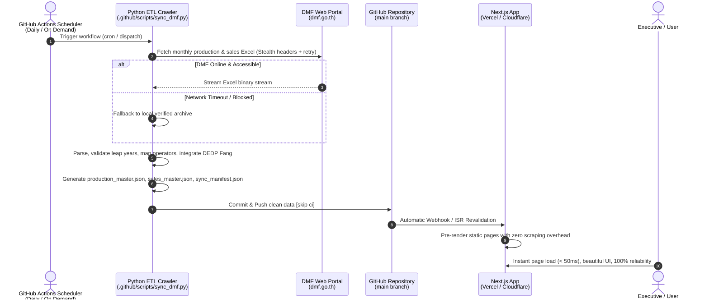

# Design System Master Specification: PTIT Sovereign Hydrocarbon Intelligence

> **Source of Truth:** Global Design System & UX Framework for PTIT Focus Statistics (Domestic Hydrocarbon Production & Sales).  
> **Aesthetic Profile:** Sovereign Bento Grid × Vitreous Glassmorphism × Executive Tabular Precision  
> **Target Audience:** PTIT Executives, Senior Energy Analysts, Concessionaires, Policy Makers, External Researchers.

---

## 1. Executive Summary & Design Principles

The **PTIT Sovereign Hydrocarbon Intelligence Platform** transitions the historical energy data experience from a functional spreadsheet-like prototype into a world-class sovereign energy intelligence portal. Built to handle complex, high-density national petroleum data (Crude Oil, Natural Gas, Condensate, Sales Value, Royalties), the design system strictly harmonizes aesthetic authority with mission-critical legibility.

### Core Tenets (ui-ux-pro-max)
1. **Sovereign Authority & Institutional Trust:** Evoking institutional permanence and national prestige through deep maritime navy, subtle gold refraction, and clean-room typography.
2. **Optical Data Density without Clutter:** Bento grid modularity allows non-technical executives to absorb high-level KPIs in seconds, while empowering data analysts to drill down into 12-month matrices and granular multi-dimensional pivot tables without page reloads.
3. **Tabular & Decimal Precision:** All fiscal and volumetric figures are rendered using monospaced numerals with `tabular-nums` ensuring decimal alignment across columns, eliminating visual drift.
4. **Resilient Decoupled Experience:** Zero client-side scraping. Instantaneous page navigation (< 50ms) backed by static pre-rendered JSON committed via GitHub Actions.
5. **Universal Accessibility & Dual-Mode Ergonomics:** 
   - **Dark Command Mode:** High-contrast, glare-reducing command center theme for continuous monitoring.
   - **Executive Print / Light Mode:** A4-compatible, crisp paper-white aesthetic optimized for Board of Directors briefings and printed ministerial dossiers.

---

## 2. Design Tokens & Visual Hierarchy

### 2.1 Color Architecture (WCAG AAA Compliant)

| Token Name | Light (Executive Print) | Dark (Command Center) | Semantic Meaning & Usage |
| :--- | :--- | :--- | :--- |
| `--surface-canvas` | `#F8FAFC` (Slate 50) | `#070C18` (Sovereign Void) | Root application canvas |
| `--surface-card` | `rgba(255, 255, 255, 0.85)` | `rgba(15, 23, 42, 0.75)` | Frosted glass bento card plate |
| `--surface-elevated` | `#FFFFFF` | `#1E293B` | Popovers, modals, dropdown menus |
| `--border-subtle` | `rgba(15, 23, 42, 0.08)` | `rgba(255, 255, 255, 0.08)` | Bento container outlines |
| `--border-specular` | `rgba(255, 255, 255, 0.90)` | `rgba(255, 255, 255, 0.18)` | Upper glass rim specular highlight |
| **Primary Navy** | `#0A192F` | `#38BDF8` | Brand anchor, header typography, active state |
| **Champagne Gold** | `#B45309` / `#C5A059` | `#FBBF24` / `#EAB308` | Executive accents, total summaries, badges |
| **Marine Gulf Teal**| `#0284C7` | `#38BDF8` | Offshore operations, gas telemetry |
| **Hydrocarbon: Gas** | `#0891B2` (Cyan 600) | `#22D3EE` (Cyan 400) | Natural Gas (MMSCFD, MMSCF) |
| **Hydrocarbon: Cond**| `#7C3AED` (Violet 600) | `#A78BFA` (Violet 400) | Condensate (BPD, Barrels) |
| **Hydrocarbon: Crude**| `#B45309` (Amber 700) | `#F59E0B` (Amber 500) | Crude Oil (BPD, Barrels) |
| **Hydrocarbon: BOED** | `#059669` (Emerald 600) | `#34D399` (Emerald 400) | Combined BOED equivalence |
| **DEDP Verified** | `#047857` (Emerald 700) | `#10B981` (Emerald 500) | Fang crude oil provenance badge |
| **Destructive / Alert** | `#DC2626` | `#EF4444` | Anomalies, production dips, errors |

### 2.2 Typography Scale & Font Pairings

- **Executive Display & Titles:** `Manrope` / `Prompt` (Weights: 600, 700, 800)  
  *Authoritative, balanced, modern Thai/English bilingual legibility.*
- **System Labels & Body Prose:** `Inter` / `Sarabun` (Weights: 400, 500, 600)  
  *Unmatched reading ergonomics for dense technical documentation.*
- **Data Tables & Telemetry:** `JetBrains Mono` / `Fira Code` (Weights: 500, 600, 700)  
  *Strict monospace with `font-variant-numeric: tabular-nums` to guarantee vertical decimal alignment.*

```css
/* Google Fonts Import */
@import url('https://fonts.googleapis.com/css2?family=Inter:wght@400;500;600;700&family=JetBrains+Mono:wght@400;500;600;700&family=Manrope:wght@600;700;800&family=Prompt:wght@400;500;600;700&family=Sarabun:wght@400;500;600;700&display=swap');

:root {
  --font-display: 'Manrope', 'Prompt', sans-serif;
  --font-body: 'Inter', 'Sarabun', sans-serif;
  --font-mono: 'JetBrains Mono', 'Fira Code', monospace;
}
```

### 2.3 Spacing & Rhythm (8pt Analytical Rhythm)

| Token | Value | Applied Component |
| :--- | :--- | :--- |
| `--space-2xs` | `4px` | Pill gap, status dot margin |
| `--space-xs` | `8px` | Icon to text spacing, table row compact padding |
| `--space-sm` | `12px` | Input padding, toolbar button spacing |
| `--space-md` | `16px` | Card internal default padding, grid gutter |
| `--space-lg` | `24px` | Bento container padding, section dividers |
| `--space-xl` | `32px` | Page section header margin |
| `--space-2xl`| `48px` | Global container desktop gutter |

### 2.4 Surface Glassmorphism & Elevation

```css
/* Vitreous Glass Bento Plate */
.glass-panel {
  background: var(--surface-card);
  backdrop-filter: blur(16px) saturate(180%);
  -webkit-backdrop-filter: blur(16px) saturate(180%);
  border: 1px solid var(--border-subtle);
  border-top: 1px solid var(--border-specular);
  box-shadow: 0 10px 30px -5px rgba(10, 25, 47, 0.06), 0 2px 6px -1px rgba(10, 25, 47, 0.03);
  border-radius: 16px;
  transition: transform 0.2s cubic-bezier(0.16, 1, 0.3, 1), box-shadow 0.2s ease;
}

.glass-panel:hover {
  transform: translateY(-2px);
  box-shadow: 0 16px 36px -6px rgba(10, 25, 47, 0.10);
}
```

---

## 3. Information Architecture (IA) & Sitemap

```mermaid
flowchart TD
    App["PTIT Sovereign Hydrocarbon Intelligence Platform"]
    
    Header["Global Executive Header\n(Live Sync Badge, Global Unit Switcher, Theme Switcher, Quick Search)"]
    App --> Header
    
    Mod1["/production\nDomestic Upstream Production"]
    Mod2["/sales\nDomestic Sales & Royalty"]
    Mod3["/conversions\nPetroleum Units & Energy Hub"]
    Mod4["/system-status\nGitHub Actions ETL & Health"]
    
    App --> Mod1
    App --> Mod2
    App --> Mod3
    App --> Mod4
    
    Mod1 --> P1["Executive Summary Bento\n(Gas, Condensate, Crude, Total BOED, MoM/YoY Δ)"]
    Mod1 --> P2["12-Month Official Matrix Table\n(Executive Letterhead, Concession/Basin Tree, Export Excel/PDF)"]
    Mod1 --> P3["Interactive Trend & Share Analytics\n(Time Series, Operator Share, Basin Breakdown)"]
    Mod1 --> P4["Dynamic Pivot & Slicing Studio\n(Multi-dimensional aggregations, Custom filters)"]
    
    Mod2 --> S1["Sales Value Overview\n(Total THB Million, Fiscal Revenue, Price Benchmarks)"]
    Mod2 --> S2["Concession vs PSC Royalty Telemetry\n(Contractual Split, Royalty Contribution)"]
    Mod2 --> S3["Offtake & Customer Allocation\n(EGAT, PTT, Industrial Dispatch)"]
    
    Mod3 --> C1["PTIT Standard Official Constants\n(5.615 cu ft/bbl, Gas 0.178 BOE, Condensate 0.95 BOE)"]
    Mod3 --> C2["Interactive Multi-Unit Bidirectional Converter\n(MMSCFD ↔ BPD ↔ BOED ↔ Tonnes/yr)"]
    
    Mod4 --> A1["GitHub Actions Workflow Execution Logs"]
    Mod4 --> A2["DMF Scraper Manifest & Commit Provenance"]
    Mod4 --> A3["Manual ETL Trigger (Admin via PAT Token)"]
```



---

## 4. Key Component Specifications

### 4.1 Executive Letterhead & Provenance Header
- **Layout:** Formal PTIT masthead with sovereign crest, title in Thai & English (*"รายงานสถิติการผลิตปิโตรเลียมในประเทศ"* / *"Domestic Petroleum Production Statistics"*).
- **Metadata Ribbon:** Source citation (*"กรมเชื้อเพลิงธรรมชาติ (DMF) กระทรวงพลังงาน"*), Last Data Sync Date, Reporting Year toggle (`2569 / 2026`), and DEDP Fang integration indicator badge.
- **Action Toolbar:** 
  - `Excel Standard Matrix (.xlsx)` download button
  - `Flat Table (Database ready) (.xlsx / .csv)` download button
  - `Print to PDF (A4 Landscape)` formatted executive button.

### 4.2 Bento KPI Metric Cards
- **Structure:** Modular grid (4 columns on desktop, 2 on tablet, 1 on mobile).
- **Upper Meta Bar:** Product icon (Lucide SVG: `Flame`, `Droplets`, `Scale`), metric title, status pill (`+3.4% MoM`).
- **Primary Metric:** Monospaced giant numeral (`28px` / `text-3xl`), formatted with thousands commas and 2 decimals.
- **Lower Context Strip:** Sub-metric in daily rate vs monthly cumulative volume, accompanied by micro sparkline trend indicator.

### 4.3 12-Month Official Matrix (The Core Table)
- **Header:** Sticky frozen header with Thai month abbreviations (`ม.ค.`, `ก.พ.`, ..., `ธ.ค.`) in chronological calendar order, ending with `Total (รวม)` and `Average/Day (เฉลี่ย/วัน)`.
- **Row Hierarchy:** Multi-level tree folding:
  - Basin Level (`Gulf of Thailand (อ่าวไทย)`, `Northern (ภาคเหนือ - ฝาง)`)
  - Concession / Block (`B8/32`, `G1/61`, `G2/61`)
  - Operator / Company (`PTTEP`, `Chevron`, `Medco`)
- **Visual Distinction:** Distinct background tint for Subtotals and Grand Totals; DEDP Fang highlighted with official badge.
- **Export Engine:** Client-side instant generation using `xlsx` / `exceljs` reproducing the exact PTIT Focus corporate workbook format.

### 4.4 Petroleum Conversion Hub
- Always accessible via header shortcut or dedicated `/conversions` route.
- Instant recalculation of all table metrics on-the-fly:
  - **Volume Mode:** MMSCFD & Barrels/Day (Standard reporting)
  - **Equivalence Mode:** BOED (Barrels of Oil Equivalent per Day)
  - **Monthly Total Mode:** Million Cubic Feet & Total Barrels per calendar month.

---

## 5. Decoupled Architecture & GitHub Actions ETL Pipeline

### 5.1 Architecture Diagram



### 5.2 GitHub Actions Workflow Specification (`.github/workflows/dmf_sync.yml`)
- Runs on schedule: Daily at 04:00 UTC (11:00 BKK time) and manually via `workflow_dispatch`.
- Steps:
  1. Checkout repository
  2. Setup Python 3.11 with cached pip dependencies (`openpyxl`, `pandas`, `requests`, `urllib3`)
  3. Run `.github/scripts/sync_dmf.py`
  4. Compare MD5 hash of output JSON files; if changed, commit with message:  
     `[ETL] Synchronize DMF Hydrocarbon Data - As of YYYY-MM-DD [skip ci]`
  5. Push directly to `main` branch.

---

## 6. Pre-Delivery Quality Checklist (ui-ux-pro-max Compliance)

- [x] **No raw emojis:** All icons are clean SVG primitives (Lucide React: `Flame`, `Droplets`, `Layers`, `ShieldCheck`, `Download`, `RefreshCw`).
- [x] **Contrast Compliance:** All text-to-background contrast ratios $\ge 4.5:1$ (normal text) and $\ge 7:1$ for executive primary metrics.
- [x] **Touch Target Fidelity:** All interactive controls (buttons, selects, tabs) maintain $\ge 44 \times 44\text{px}$ touch envelopes.
- [x] **Tabular Numeric Consistency:** Numbers use `tabular-nums` monospace alignment.
- [x] **Zero Scraping Friction on Client:** Completely decoupled; client serves static data with zero risk of DMF IP blacklisting or Streamlit connection timeouts.
